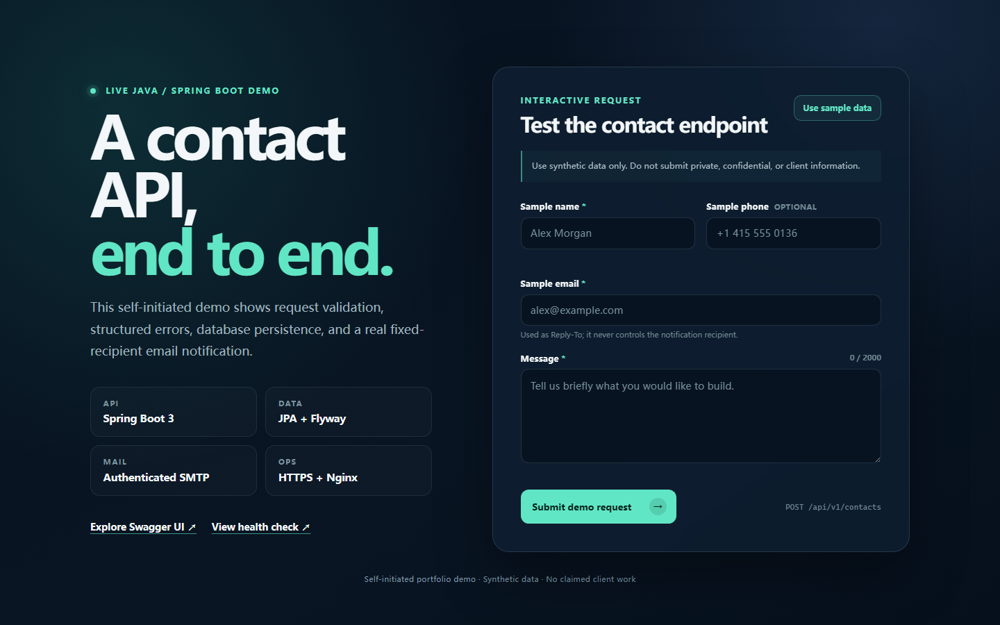
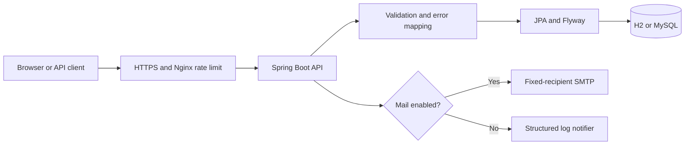

# Production-Style Contact Form REST API

A runnable Spring Boot reference implementation for accepting, validating,
storing, and notifying an owner about contact-form submissions.

This is a self-initiated technical demonstration built with synthetic data. It
is public evidence of engineering decisions and is not presented as client
work.

[Live demo](https://124.222.121.103/contact-demo/) | [Swagger UI](https://124.222.121.103/contact-demo/swagger-ui/index.html) | [OpenAPI JSON](https://124.222.121.103/contact-demo/v3/api-docs) | [Health](https://124.222.121.103/contact-demo/actuator/health) | [Request a similar implementation](SERVICES.md)

> The public instance is an independently hosted portfolio service and may be
> briefly unavailable during maintenance. Submit synthetic data only. The
> current live instance runs the Spring Boot 3.5.16 release JAR built from this
> repository.



## What this demonstrates

- A versioned `POST /api/v1/contacts` API with a small, explicit contract
- Bean Validation and stable, field-level JSON errors
- JPA persistence with a Flyway-managed schema for H2 or MySQL 8
- A fixed-recipient SMTP adapter that uses the validated email only as Reply-To
- A logging adapter when outbound mail is disabled
- Configurable CORS, health probes, OpenAPI documentation, and a Postman collection
- Automated controller, service, persistence, static-asset, and SMTP-adapter tests
- Docker Compose for a local MySQL and Mailpit environment
- Loopback-only systemd and Nginx deployment examples

## System at a glance



The notification recipient comes from server-side configuration. A form user
cannot select an arbitrary recipient, which prevents the endpoint from becoming
an open mail relay.

## Run locally

Requirements: Java 17 and Maven 3.9 or newer.

```bash
mvn clean verify
mvn spring-boot:run
```

Open these local URLs:

- Demo client: <http://127.0.0.1:8080/>
- Swagger UI: <http://127.0.0.1:8080/swagger-ui.html>
- OpenAPI JSON: <http://127.0.0.1:8080/v3/api-docs>
- Health: <http://127.0.0.1:8080/actuator/health>

The default profile uses an in-memory H2 database and logs the notification
step instead of sending email.

## Try the API

```bash
curl -i http://127.0.0.1:8080/api/v1/contacts \
  -H 'Content-Type: application/json' \
  -d '{
    "name": "Demo User",
    "email": "demo@example.com",
    "phone": "+1 415 555 0136",
    "message": "I would like to discuss a small Spring Boot project."
  }'
```

A successful request returns HTTP `201`:

```json
{
  "id": 1,
  "status": "accepted",
  "submittedAt": "2026-07-16T01:02:03Z"
}
```

Validation failures return HTTP `400` with a stable machine-readable code and
field errors. Unknown JSON fields are rejected rather than silently ignored.

## Run the full local stack

The Compose stack starts MySQL, Mailpit, and the API. Mailpit captures messages
locally and does not deliver external email.

```bash
docker compose up --build
```

- API: <http://127.0.0.1:8080/>
- Mailpit inbox: <http://127.0.0.1:8025/>

Copy `.env.example` to `.env` only when you need to override the safe local
defaults. The `.env` file and all `*.local.env` files are excluded from Git and
the Docker build context.

## Configuration

| Variable | Purpose |
| --- | --- |
| `SPRING_DATASOURCE_URL` | JDBC URL for H2 or MySQL |
| `SPRING_DATASOURCE_USERNAME` | Database username |
| `SPRING_DATASOURCE_PASSWORD` | Database password |
| `APP_CORS_ALLOWED_ORIGINS` | Comma-separated trusted frontend origins |
| `APP_MAIL_ENABLED` | Enables the SMTP adapter when set to `true` |
| `SMTP_HOST`, `SMTP_PORT` | SMTP endpoint |
| `SMTP_USERNAME`, `SMTP_PASSWORD` | Optional SMTP credentials |
| `SMTP_AUTH`, `SMTP_SSL`, `SMTP_STARTTLS` | SMTP security switches |
| `CONTACT_MAIL_FROM`, `CONTACT_MAIL_TO` | Fixed sender and notification recipient |

Use `smtp.local.env.example` as a template for a real SMTP provider. Supply
credentials only through local or server runtime configuration. Never commit a
mailbox password, SMTP authorization code, API token, or production database
credential.

## Engineering decisions

- **Strict input boundary:** supported fields are explicit, strings are trimmed,
  sizes are bounded, and malformed or unknown JSON is rejected.
- **Stable error contract:** validation, unsupported media, missing resources,
  mail-provider failures, and unexpected failures have structured responses.
- **Database portability:** Flyway owns the schema; H2 runs in MySQL-compatible
  mode for the lightweight demo while Compose verifies the MySQL path.
- **Mail safety:** the sender and recipient are controlled by the server; the
  request email is used only as Reply-To.
- **Deployment isolation:** the example service listens on loopback, runs as an
  unprivileged user, and is exposed only through an HTTPS reverse proxy.
- **Reproducible verification:** every push and pull request runs `mvn clean
  verify` in GitHub Actions, while Dependabot monitors Maven and Actions updates.

## Known limitations and production extensions

This repository keeps the workflow intentionally small. A production system
may also require:

- CAPTCHA or a honeypot plus API-level rate limiting
- An outbox or queue so database writes and external notifications are retried independently
- Idempotency keys and duplicate-submission detection
- Data-retention, deletion, consent, and privacy controls
- Authentication and an administrative review interface
- Metrics, tracing, alerting, backups, and provider-specific delivery monitoring

These are explicit extension points, not features silently implied by the demo.

## Repository map

```text
src/main/java/       API, application, domain, persistence, and notification code
src/main/resources/  Configuration, Flyway migration, and interactive demo
src/test/             Unit and integration tests
postman/              Importable request collection
deploy/               Nginx, systemd, and server configuration examples
.github/              CI and dependency-update configuration
```

## Reuse and implementation help

The source is available under the [MIT License](LICENSE). You may reuse it under
that license, but you remain responsible for reviewing security, privacy, and
provider requirements for your environment.

Need a similar API, integration, or deployment review? See
[implementation services](SERVICES.md) for the information needed to define a
small, testable scope.

## Disclosure

Self-initiated technical demo using synthetic data. No client source code,
client data, client branding, or claimed commercial deployment is included.
